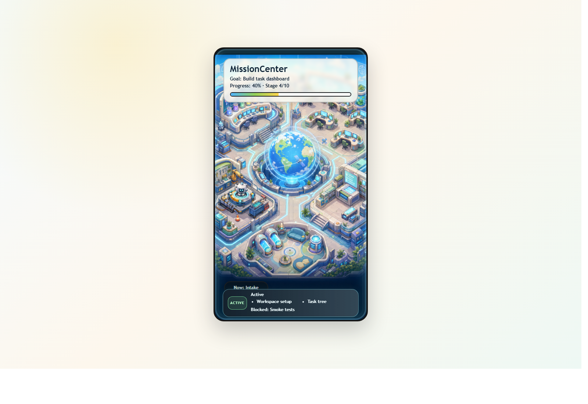

# Codex Mission Center

Mission Center is an offline, file-based Codex plugin and skill for turning vague goals into a local task workspace.
It is inspired by Linear-style project tracking and Superpowers-style execution discipline, but it does not connect to Linear or any external app.

Mission Center is per-project only.
Use it inside the current repo/workspace.
It creates or reads `./MissionCenter/`.
It does not monitor all repositories.
It does not merge tasks across projects.



## What It Does

- Asks exactly one focused intake question per turn until the goal is clear.
- Runs a creative cross-domain council when analogy can produce feasible ideas.
- Searches prior art before implementation, with Jina fallback and license checks.
- Routes each project through an Adaptive Optimization Gate instead of forcing one method everywhere.
- Routes consequential decisions through a Dynamic Expert Council while letting deterministic work skip the meeting entirely.
- Runs bounded, repository-local Shadow evaluations whose winners require manual review.
- Presents approaches and writes only the user-approved rolling task draft.
- Creates or reuses `MissionCenter/` in the current workspace.
- Tracks project summary, progress, tasks, decisions, notes, snapshots, and smoke tests.
- Uses a model-free daily journal, approved guardrails, and disposable `brief.md` / `focus.md` views to reduce repeated context loading.
- Keeps task state local and readable as Markdown.
- Follows the user's language for generated workspace files, including Traditional Chinese.
- Shows one animated HUD helper per task and moves it with the task lifecycle.
- Optionally shows connected Codex app-server agents in a separate live runtime panel.

## Plugin Layout

```text
.codex-plugin/plugin.json
assets/mission-center.svg
skills/
  mission-center/
    SKILL.md
    agents/
    references/
    scripts/
    assets/
```

Codex plugin hosts should read `.codex-plugin/plugin.json`, then load the bundled skill from `skills/mission-center/`.

## Read Here

Call your Codex:

```text
Use $mission-center to plan this goal, ask intake questions first, then create a MissionCenter workspace.
```

Install helpers live in `scripts/`. They delegate to one deterministic publisher so
the personal Skill and local marketplace plugin cannot silently drift apart.

The skill will create files like:

```text
MissionCenter/
  brief.md
  focus.md
  guardrails.md
  daily-log.md
  project.md
  progress.md
  tasks.md
  decisions.md
  smoke-tests.md
  notes.md
  snapshot.md
  closeout.md
  visual-hub.md
output/
  mission-center-assets/
    visual-summary.html
    visual-state.json
    update-visual-state.ps1
    mission-base-main.png
    mission-helper-roster-8-fixed.png
    mission-helper-roster-8-girls-2.png
  mission-center-optimization/
    <experiment>-result.json
  mission-center-runtime/
    runtime-state.json
    task-links.json
```

Open `output/mission-center-assets/visual-summary.html` to view the static task HUD. For live runtime data, start the loopback companion and open the printed URL:

```bash
python skills/mission-center/scripts/mission_runtime.py --workspace . serve --port 8765
```

The companion is optional. If runtime data or `websockets` is unavailable, the existing static task HUD remains usable. The compact attention capsule stays quiet during ordinary work and opens a Live Agents drawer only when requested. Live connections observe only sessions connected to the chosen endpoint; they are not global desktop monitoring.

## Adaptive Optimization

Profile and route a structured project description:

```bash
python skills/mission-center/scripts/mission_optimizer.py profile --input project-profile.json --output output/mission-center-optimization/profile.json
python skills/mission-center/scripts/mission_optimizer.py route --profile output/mission-center-optimization/profile.json
python skills/mission-center/scripts/mission_optimizer.py shadow --manifest experiment.json --observations observations.json --workspace .
```

`shadow` evaluates read-only observation fixtures under explicit budgets. It never runs arbitrary commands or adopts a winner. Metrics stay separate unless the manifest declares normalization and weights.

## Optional Runtime Adapter

Replay a privacy-safe JSONL fixture or connect to an explicitly launched Codex app-server over stdio. WebSocket remains an optional transport for an explicitly exposed endpoint:

```bash
python skills/mission-center/scripts/mission_runtime.py --workspace . replay events.jsonl
python skills/mission-center/scripts/mission_runtime.py --workspace . link --agent agent-id --task MC-009
python skills/mission-center/scripts/mission_runtime.py --workspace . connect --stdio
python -m pip install -r requirements-runtime.txt
python skills/mission-center/scripts/mission_runtime.py --workspace . connect --url ws://127.0.0.1:4500
```

On Windows, a Microsoft Store/WindowsApps-packaged Codex executable may reject direct subprocess launch. In that case, pass `--codex-executable` with a standalone Codex CLI path; Mission Center does not fall back to a shell wrapper.

Runtime events never edit `MissionCenter/tasks.md`. Persisted telemetry excludes prompts, reasoning, complete commands, tool arguments, environment values, and secrets.

Passive runtime observation does not invoke a model and therefore adds no model-token usage. The connected agents' own work still uses their normal quota. Only explicitly enabled LLM classification or agent-driven experiment trials consume model tokens, and those paths must honor the manifest budget.

The shortest local workflow is:

```bash
python skills/mission-center/scripts/bootstrap_mission_center.py . --language zh-TW
python skills/mission-center/scripts/sync_mission_center.py .
python skills/mission-center/scripts/doctor_mission_center.py .
```

Resume with compact context or record one daily event without a model call:

```bash
python skills/mission-center/scripts/mission_maintenance.py . status
python skills/mission-center/scripts/mission_maintenance.py . daily --message "Verified parser fix"
python skills/mission-center/scripts/mission_maintenance.py . sync
```

`tasks.md` remains the only task lifecycle source. `brief.md` and `focus.md` are content-fingerprinted materialized views and are safe to delete and rebuild. Guardrail changes require explicit human approval.

## Local Publishing

The repository is the only authoring source. Preview changes before publishing:

```text
python scripts/publish_local.py --repo . --personal-skill ~/.codex/skills/mission-center --marketplace-plugin ~/.codex/local-marketplaces/mission-center/plugins/mission-center --dry-run
```

Use `--write` to replace both derived copies through staging directories, then use
`--verify` to detect drift. Add `--register` when you also want Codex to refresh the
local marketplace registration and reinstall the plugin with its icon metadata.
The bundled `scripts/install-unix.sh`, `scripts/install-plugin-unix.sh`,
`scripts/install-windows.ps1`, and `scripts/install-plugin-windows.ps1` wrappers
do this automatically for `--write`.

## Visual Assets

Mission Center bundles the HUD assets needed for offline use:

- `skills/mission-center/assets/visual-hub/mission-base-main.png`
- `skills/mission-center/assets/visual-hub/mission-helper-roster-8-fixed.png`
- `skills/mission-center/assets/visual-hub/mission-helper-roster-8-girls-2.png`
- `skills/mission-center/assets/visual-hub/visual-summary.html`
- `skills/mission-center/assets/visual-hub/update-visual-state.ps1`

## macOS Notes

The bundled Python scripts use `pathlib` and should work on macOS, Linux, and Windows with Python 3.
Shell examples use `~/.codex/skills` on macOS/Linux and `%USERPROFILE%\.codex\skills` on Windows.

## Attribution

This project is independently written and maintained.
It is inspired by the workflow concepts of Linear and Superpowers, but it does not include their app integrations, trademarks, code, documentation, icons, or branding.

## License

MIT License. See [LICENSE](LICENSE).
