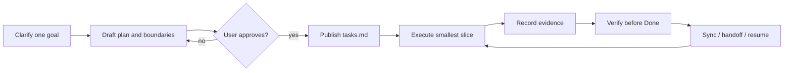

# Codex Mission Center

[](https://github.com/Gale0418/Codex-Mission-Center/actions/workflows/ci.yml)
[](LICENSE)
[](.codex-plugin/plugin.json)
[](https://www.python.org/downloads/release/python-3110/)

**Turn an unclear goal into a local, reviewable, evidence-backed task workspace for Codex.**

Mission Center is an offline, file-based Codex plugin and skill for one project at a time. It clarifies intent, drafts a rolling plan for approval, preserves causal handoffs, and keeps verification close to the task data. It is not a hosted project-management service and is not a `pip` or `npm` package.

<p align="center">
  
</p>

<p align="center"><strong><a href="#quick-start">Start locally</a></strong> · <a href="README.zh-TW.md">繁體中文</a> · <a href="skills/mission-center/SKILL.md">Read the skill contract</a></p>

## Is this for you?

Mission Center fits work that benefits from an explicit goal, bounded decisions, a durable handoff, or repeatable completion evidence:

- multi-day work that must survive a new thread or a context reset;
- projects split across several approved agents or stages;
- risky changes where stale, contradictory, corrupt, or falsely-claimed `Done` states need a gate;
- local planning where Markdown files should remain inspectable, diffable, and portable.

For a short, single-turn task, bare Codex is usually simpler and cheaper. Mission Center adds a workspace and process; use it when that continuity is worth the overhead.

## The workflow



## Truth and boundaries

Mission Center is deliberately narrow:

- **Per-project and local:** `MissionCenter/tasks.md` is the only task lifecycle truth. `brief.md` and `working-set.md` are rebuildable views; `focus.md`, when present, is a deprecated compatibility view.
- **Runtime is separate:** the optional Runtime/HUD observes an explicitly launched or connected endpoint. It never edits `tasks.md`, task order, status, or the lifecycle source.
- **No global service:** Mission Center is per-project only. Use it inside the current repo/workspace. It creates or reads `./MissionCenter/`. It does not monitor all repositories. It does not merge tasks across projects.
- **Approval is real:** external research, real agent dispatch, LLM classification, and additional budgets are opt-in. Local fixtures and synthetic evaluations are not measurements of production performance.
- **Offline by default:** the core is Python standard-library code. Only the optional WebSocket Runtime needs the dependencies in `requirements-runtime.txt`; CI and release installation use the hashed `requirements-runtime.lock`.

## Quick start

First install Mission Center from this source checkout using the supported wrapper in [Install and publish locally](#install-and-publish-locally). Then open any target repository/workspace in Codex and invoke the installed skill:

```text
Use $mission-center to clarify this goal, ask intake questions first, and create a MissionCenter workspace after I approve the plan.
```

The commands below are for this source checkout's own dogfood workspace and maintenance. They are not generic commands to copy into an arbitrary repository before installation:

```bash
# From this repository (source checkout / dogfood maintenance)
python skills/mission-center/scripts/bootstrap_mission_center.py . --language en
python skills/mission-center/scripts/sync_mission_center.py .
python skills/mission-center/scripts/doctor_mission_center.py .
```

After installation, the equivalent scripts live under the installed skill (for example, `$CODEX_HOME/skills/mission-center/scripts/`) and must be pointed at the target repository; invoking `$mission-center` is the normal route.

For a Traditional Chinese workspace, use `--language zh-TW`. Sync is migration-safe by default; use `--rewrite-summaries` only when you intentionally want Mission Center to regenerate existing `project.md` and `progress.md` summaries. `doctor` treats Done tasks without passing evidence as errors; only entries listed individually in `MissionCenter/legacy-done-audit.json` are downgraded to visible warnings, and they never count as passing smoke tests.

## Install and publish locally

This repository is the authoring source. The supported installation wrappers publish the skill and local marketplace plugin; they do not install a package from PyPI or npm.

Windows (PowerShell):

```powershell
pwsh -ExecutionPolicy Bypass -File ./scripts/install-windows.ps1
```

macOS / Linux:

```bash
bash ./scripts/install-unix.sh
```

Preview or verify the derived targets without writing them:

```bash
python scripts/publish_local.py --repo . \
  --personal-skill ~/.codex/skills/mission-center \
  --marketplace-plugin ~/.codex/local-marketplaces/mission-center/plugins/mission-center \
  --dry-run

python scripts/publish_local.py --repo . \
  --personal-skill ~/.codex/skills/mission-center \
  --marketplace-plugin ~/.codex/local-marketplaces/mission-center/plugins/mission-center \
  --verify
```

On Windows, set equivalent absolute paths or use the wrapper defaults under `%CODEX_HOME%` / `%USERPROFILE%\.codex`. The Windows wrapper adds `--register` for `--write`; registration requires a resolvable Codex CLI. If you only need the published files and do not have a resolvable CLI, run `publish_local.py --write` without `--register`:

```powershell
python .\scripts\publish_local.py --repo . `
  --personal-skill "$env:USERPROFILE\.codex\skills\mission-center" `
  --marketplace-plugin "$env:USERPROFILE\.codex\local-marketplaces\mission-center\plugins\mission-center" `
  --write
```

## Workspace architecture

The canonical file contract lives in [`workspace_contract.py`](skills/mission-center/scripts/workspace_contract.py). A generated workspace contains these required files:

```text
MissionCenter/
├── brief.md
├── working-set.md
├── critical-lessons.md
├── guardrails.md
├── daily-log.md
├── project.md
├── progress.md
├── tasks.md              # only lifecycle truth
├── decisions.md
├── smoke-tests.md
├── notes.md
├── snapshot.md
├── closeout.md
└── visual-hub.md
```

`brief.md` and `working-set.md` are content-fingerprinted materialized views and may be rebuilt. `critical-lessons.md` keeps active lessons bounded (6 KiB) and points to detailed incident evidence. Guardrail changes require explicit human approval. The repository's own dogfood workspace is intentionally trackable and is checked by CI.

## Optional capabilities

> **Path note:** The commands in this section use a source checkout. After installation, call the scripts from `$CODEX_HOME/skills/mission-center/` (Windows: `%CODEX_HOME%` or `%USERPROFILE%\.codex`) and pass `--workspace <target-repo>` for the repository you want to observe or analyze. `requirements-runtime.txt` lives at the source-checkout root; install it from that checkout (or an equivalent absolute path) before enabling WebSocket Runtime.

### HUD and Runtime

The static HUD is generated from task state. For live Runtime data, the recommended path is to start the loopback companion and open the printed loopback URL:

```bash
python skills/mission-center/scripts/mission_runtime.py --workspace . serve --port 8765
```

Opening the HTML directly with `file://` is a static fallback only. Browser `fetch`/CORS rules can make live data unavailable in that mode.

Runtime can replay a privacy-safe JSONL fixture, link an explicitly connected agent to a task, or connect to an explicitly launched stdio/WebSocket endpoint. It records bounded metadata rather than prompts, reasoning, complete commands, tool arguments, environment values, or secrets:

```bash
python skills/mission-center/scripts/mission_runtime.py --workspace . replay events.jsonl
python skills/mission-center/scripts/mission_runtime.py --workspace . link --agent agent-id --task MC-009
python skills/mission-center/scripts/mission_runtime.py --workspace . connect --stdio
python -m pip install -r requirements-runtime.txt
python skills/mission-center/scripts/mission_runtime.py --workspace . connect --url ws://127.0.0.1:4500
```

Passive observation does not call a model. Connected agents still use their normal quota; explicitly enabled LLM classification or agent-driven trials must follow their manifest budget. If Runtime or `websockets` is unavailable, the static HUD remains usable.

### Adaptive optimization and bounded evaluation

Optimization is a route, not a promise of a numerical optimum. It needs measurable signals, hard constraints, a budget, and a stopping rule; otherwise Mission Center routes back to research or decision-making. Shadow evaluations are read-only fixture analyses and never auto-adopt a winner:

```bash
python skills/mission-center/scripts/mission_optimizer.py profile \
  --input project-profile.json --output output/mission-center-optimization/profile.json
python skills/mission-center/scripts/mission_optimizer.py route \
  --profile output/mission-center-optimization/profile.json
python skills/mission-center/scripts/mission_optimizer.py shadow \
  --manifest experiment.json --observations observations.json --workspace .
```

Other bounded routes include Pulse/Handoff continuity, Steelman Evolution, Research Portfolio/Saturation, and privacy-safe Shift-Loss self-evaluation. Their artifacts are evidence for review, not automatic task changes or real-world benchmark claims.

## What the evidence says

Mission Center's value is continuity and evidence quality, not a made-up token-saving statistic:

- A short, single continuous task is often cheaper with bare Codex.
- Cross-day, cross-thread, cross-agent work and multi-stage verification are the intended use case.
- This repository has no paired same-model token telemetry, so it cannot support a precise token-savings claim.
- The practical gain is continuity across longer or cross-shift work: causal handoff, revision-bound evidence, and explicit stale / contradictory / corrupt / False Done gates.

## Verification

CI runs the unit suite and a single local workspace check on Ubuntu and Windows with Python 3.11. For a local verification:

```bash
python -m unittest discover -s tests -p "test_*.py" -v
```

The release checklist also covers bootstrap, doctor, publish dry-run, publish verify, and the per-project boundaries: [`RELEASE_CHECKLIST.md`](RELEASE_CHECKLIST.md).

## Docs, security, and license

- Contract and routing: [`skills/mission-center/SKILL.md`](skills/mission-center/SKILL.md)
- Design notes: [`DESIGN.md`](DESIGN.md)
- Supply-chain policy: [`docs/supply-chain-policy.md`](docs/supply-chain-policy.md)
- Privacy: [`PRIVACY.md`](PRIVACY.md)
- Attribution and notices: [`NOTICE.md`](NOTICE.md)
- Release process: [`RELEASE_CHECKLIST.md`](RELEASE_CHECKLIST.md)

Mission Center is independently written and maintained. It is inspired by the workflow concepts of Linear and Superpowers, but it does not include their app integrations, trademarks, code, documentation, icons, or branding.

Released under the [MIT License](LICENSE).
