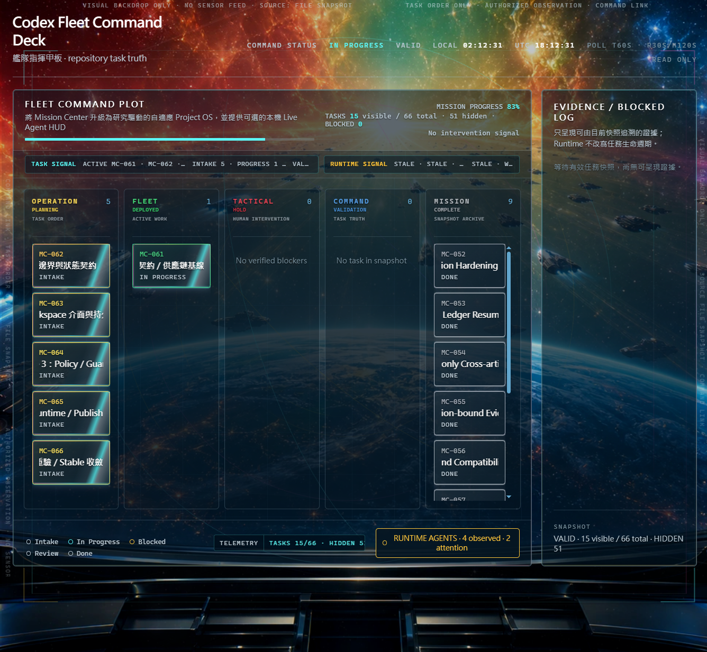
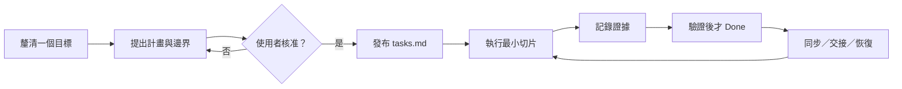

# Codex Mission Center 任務中心

[](https://github.com/Gale0418/Codex-Mission-Center/actions/workflows/ci.yml)
[](LICENSE)
[](.codex-plugin/plugin.json)
[](rust/rust-toolchain.toml)

**把模糊目標變成 Codex 可持續接手、可審查、以證據收尾的本地任務工作區。**

Mission Center 是一次只服務一個專案的離線、檔案型 Codex 外掛與 Skill。它協助釐清意圖、讓你核准滾動式計畫、保存因果式交接，並把驗證證據留在任務資料旁邊。它不是託管式專案管理服務，也不是 `pip` 或 `npm` 套件。

<p align="center">
  
</p>
<p align="center"><em>這是 Mission Center 0.5.1 的本機 file-snapshot HUD；呈現的是受限 repository 證據，不是全域 live sensor。</em></p>

<p align="center">
  
</p>

<p align="center"><strong><a href="#快速開始">開始使用</a></strong> · <a href="README.md">English</a> · <a href="skills/mission-center/SKILL.md">閱讀 Skill 契約</a></p>

## 適合與不適合的情境

適合需要明確目標、受控決策、可恢復交接或可重複完成證據的工作：

- 需要跨日、跨 thread 或 context reset 後繼續的工作；
- 分成多個已核准 Agent 或多階段執行的專案；
- 需要防止 stale、矛盾、損壞或虛假 `Done` 狀態的高風險變更；
- 希望規劃資料保持可讀、可 diff、可攜帶的本地專案。

短而單一連續的任務，裸 Codex 通常更簡單也更省；Mission Center 會增加工作區與流程，只有在連續性值得這份成本時才使用。

## 核心工作流



## 真實來源與邊界

Mission Center 故意保持狹窄：

> **Rust-only stable（0.5.1）：**正式 Plugin 入口是有版本契約的
> `mission-center` Rust CLI 與四平台 frozen package。下方保留的 Python
> scripts 只供 differential test／migration diagnostics 使用，不會放入
> stable Plugin，也不會作為 runtime fallback。

- **只限單一專案：** `MissionCenter/tasks.md` 是唯一的任務生命週期真實來源。`brief.md` 與 `working-set.md` 是可重建視圖；若存在，`focus.md` 是已棄用的相容視圖。
- **Runtime 與任務分離：** 可選的 Runtime／HUD 只觀察明確啟動或連接的 endpoint，絕不修改 `tasks.md`、任務順序、狀態或生命週期真實來源。
- **沒有全域服務：** Mission Center is per-project only. Use it inside the current repo/workspace. It creates or reads `./MissionCenter/`. It does not monitor all repositories. It does not merge tasks across projects.
- **核准是真正的閘門：** 外部研究、真實 Agent 派遣、LLM 分類與額外預算都是 opt-in。本地 fixture 與合成評估不是生產效能測量。
- **預設離線：**正式核心使用鎖定且離線的 Rust toolchain。可選
  WebSocket Runtime 與 Python oracle 保留明確的相容依賴，但都不是正式
  Plugin fallback。

## 快速開始

先依[正式安裝與本機發布](#正式安裝與本機發布)使用支援的 wrapper 從此 source checkout 安裝 Mission Center，再用 Codex 開啟任意目標 repository／workspace，invoke 已安裝的 Skill：

```text
使用 $mission-center 釐清這個目標，先進行訪談，等我核准計畫後再建立 MissionCenter 工作區。
```

正式 Rust front door：

```bash
mission-center status --root .
mission-center resume --root .
mission-center doctor --root .
```

以下 Python 命令只供此 source checkout 的 oracle／migration diagnostics，
不是安裝前可直接複製到任意 repository 的通用命令：

```bash
# 在此 repository 執行（source checkout／dogfood 維護）
python skills/mission-center/scripts/bootstrap_mission_center.py . --language zh-TW
python skills/mission-center/scripts/sync_mission_center.py .
python skills/mission-center/scripts/doctor_mission_center.py .
```

以上指令是在本 source checkout 內執行。使用預設的 plugin-only 安裝時，一般路徑是直接由 Codex invoke Mission Center；只有使用 `--with-personal-skill`（或 `-WithPersonalSkill`）時，才會有穩定的 `$CODEX_HOME/skills/mission-center/scripts/` 路徑。

英文工作區可將語言改成 `--language en`。同步預設採安全遷移模式；只有你明確希望 Mission Center 重新生成既有 `project.md` 與 `progress.md` 摘要時，才使用 `--rewrite-summaries`。`doctor` 對沒有 passing evidence 的 Done 任務會報錯；只有逐項列在 `MissionCenter/legacy-done-audit.json` 的項目才會降為可見 warning，而且不算通過 smoke test。

## 正式安裝與本機發布

本 repository 是唯一的 authoring source。正式安裝必須使用已驗證的 Rust
`frozen-package-v1`，不會自動編譯、下載或 fallback 到 Python。下方
source-checkout wrapper 只屬於相容發布工具，必須明確設定
`MISSION_CENTER_PYTHON_COMPAT=1`；沒有 opt-in 會 fail-closed。修改這個
checkout 的檔案不會即時更新 Codex 快取。

Windows（PowerShell）：

```powershell
$env:MISSION_CENTER_PYTHON_COMPAT = "1"  # 僅相容發布
pwsh -ExecutionPolicy Bypass -File ./scripts/install-windows.ps1
```

macOS／Linux：

```bash
MISSION_CENTER_PYTHON_COMPAT=1 bash ./scripts/install-unix.sh
```

Plugin 已內含 Mission Center Skill。若仍需要舊式的獨立個人 Skill 相容副本，必須明確選用：

```powershell
pwsh -ExecutionPolicy Bypass -File ./scripts/install-windows.ps1 -WithPersonalSkill
```

```bash
bash ./scripts/install-unix.sh --with-personal-skill
```

預設 wrapper 也會清除既有的獨立個人 Skill，但只有內容與受管理副本完全一致時才會移除；若曾修改或屬於使用者自有內容，安裝會保留它並以可操作的錯誤停止。

相容入口 `scripts/install.py` 與 `scripts/install.ps1` 在設定
`MISSION_CENTER_PYTHON_COMPAT=1` 時才會註冊 Plugin；正式安裝請使用已驗證
的 Rust package。

Rust stable 也能在不呼叫 Codex CLI、不開外部瀏覽器的情況下，註冊已驗證的 marketplace tree：`mission-center install register apply --plugin-root <絕對 marketplace>/plugins/mission-center --marketplace-root <絕對 marketplace> --operation-id <id> --version 0.5.1`。產生的 receipt 支援相同內容 replay、`register rollback` 與 `register reconcile`。

只預覽或驗證衍生目標、不寫檔：

```bash
python scripts/publish_local.py --repo . \
  --marketplace-plugin ~/.codex/local-marketplaces/mission-center/plugins/mission-center \
  --dry-run

python scripts/publish_local.py --repo . \
  --marketplace-plugin ~/.codex/local-marketplaces/mission-center/plugins/mission-center \
  --verify
```

Windows 可改用等價的絕對路徑，或使用 `%CODEX_HOME%`／`%USERPROFILE%\.codex` 下的 wrapper 預設值。Windows wrapper 在 `--write` 時會加入 `--register`，用 cachebuster 重新整理已安裝 Plugin；註冊需要可解析的 Codex CLI。若只要發布檔案、沒有可解析的 CLI，可直接執行 `publish_local.py --write` 且不加 `--register`：

```powershell
python .\scripts\publish_local.py --repo . `
  --marketplace-plugin "$env:USERPROFILE\.codex\local-marketplaces\mission-center\plugins\mission-center" `
  --write
```

只有在確實需要獨立相容副本時，才傳入 `--personal-skill <以 skills/mission-center 結尾的路徑>`。

## 工作區架構

canonical 檔案契約位於 [`workspace_contract.py`](skills/mission-center/scripts/workspace_contract.py)。產生的工作區包含以下必要檔案：

```text
MissionCenter/
├── brief.md
├── working-set.md
├── critical-lessons.md
├── guardrails.md
├── daily-log.md
├── project.md
├── progress.md
├── tasks.md              # 唯一生命週期真實來源
├── decisions.md
├── smoke-tests.md
├── notes.md
├── snapshot.md
├── closeout.md
└── visual-hub.md
```

`brief.md` 與 `working-set.md` 是有內容指紋的 materialized view，可以重建。`critical-lessons.md` 的 Active Lessons 上限為 6 KiB，詳細事故證據放在 incidents。護欄變更需要人工明確核准。本 repository 自己的 dogfood 工作區也可被追蹤，並由 CI 檢查。

## 可選能力

> **路徑提醒：** 本節命令均以 source checkout 為例。plugin-only 安裝請直接由 Codex 使用 Mission Center；只有需要穩定的 `$CODEX_HOME/skills/mission-center/` 手動腳本路徑時，才選用獨立個人 Skill。請以 `--workspace <target-repo>` 指定要觀察或分析的 repository。`requirements-runtime.txt` 位於 source checkout 根目錄；啟用 WebSocket Runtime 前，請從該 checkout（或等價的絕對路徑）安裝它。

以下 Python 命令在 0.5.1 preview 階段僅作相容／oracle 工具；正式 Hook 與 Plugin 寫入路徑使用 Rust CLI。

### HUD 與 Runtime

靜態 HUD 由任務狀態產生。要看 live Runtime 資料，可由 Rust CLI 啟動有界的 loopback companion：

```bash
mission-center hud launch --foreground --root . --port 8765
```

由 Codex Hook 召喚時，Rust `hook hud` adapter 會針對目前 workspace 啟動或重用
一個健康的 loopback companion，並在 hook `additionalContext` 輸出由宿主管理的
`mission-center/hud-side-panel` intent。Intent 只含有界 loopback URL 與穩定的
workspace `reuseKey`，同時寫入
`output/mission-center-runtime/hud-side-panel.json`。目前 Codex 本機
app-server schema 沒有公開的 sidebar／open-URL 方法，因此 Hook 不能保證在同一
回合自動開啟或聚焦側欄；若宿主支援，可把 URL 放到內建側欄／preview，否則使用
可點擊 URL。Rust Hook 不會開啟 Chrome 或其他外部瀏覽器。Python
`hud_autolaunch.py` 僅保留在相容／oracle 工具，不屬於正式 Rust plugin 執行路徑：

```bash
python skills/mission-center/scripts/hud_autolaunch.py show --workspace . --open-browser
```

`--open-browser` 是唯一的外部瀏覽器 opt-in。同一 workspace 由 singleton key
與 health check 防止啟動第二個 HUD server；側欄分頁是否重用仍由宿主管理，因為
目前沒有公開的 sidebar bridge。

直接用 `file://` 開啟 HTML 只適合作為靜態 fallback；瀏覽器的 `fetch`／CORS 規則可能讓 live 資料變成 unavailable。

Runtime 可以重播隱私安全的 JSONL fixture、把明確連接的 Agent 綁到任務，或連接明確啟動的 stdio／WebSocket endpoint。它只保存有界 metadata，不保存 prompt、reasoning、完整命令、tool arguments、環境值或 secrets：

```bash
python skills/mission-center/scripts/mission_runtime.py --workspace . replay events.jsonl
python skills/mission-center/scripts/mission_runtime.py --workspace . link --agent agent-id --task MC-009
python skills/mission-center/scripts/mission_runtime.py --workspace . connect --stdio
python -m pip install -r requirements-runtime.txt
python skills/mission-center/scripts/mission_runtime.py --workspace . connect --url ws://127.0.0.1:4500
```

被動觀察不會呼叫模型；已連接 Agent 自己執行任務時仍使用原本額度。只有明確啟用的 LLM 分類或 Agent 驅動 trial 會消耗模型 token，且必須服從 manifest 預算。Runtime 或 `websockets` 不可用時，靜態 HUD 仍可使用。

### 自適應最佳化與受控評估

最佳化是一條路由，不承諾數值最佳解。它需要可量測訊號、硬限制、預算與停止規則；否則 Mission Center 會回到研究或決策。Shadow 評估只分析唯讀 fixture，不會自動採用勝出方案：

```bash
python skills/mission-center/scripts/mission_optimizer.py profile \
  --input project-profile.json --output output/mission-center-optimization/profile.json
python skills/mission-center/scripts/mission_optimizer.py route \
  --profile output/mission-center-optimization/profile.json
python skills/mission-center/scripts/mission_optimizer.py shadow \
  --manifest experiment.json --observations observations.json --workspace .
```

其他受控路由包括 Pulse／Handoff continuity、Steelman Evolution、Research Portfolio／Saturation，以及隱私安全的 Shift-Loss self-evaluation。這些 artifact 是供審查的證據，不會自動改任務，也不是現實世界 benchmark 聲稱。

## 實測效益：誠實版本

Mission Center 的價值是連續性與證據品質，不是虛構的 token 節省統計：

- 短而單一連續的任務，裸 Codex 通常比較省。
- 跨日、跨 thread、跨 Agent 與多階段驗證，才是它的主場。
- 目前 repository 沒有 paired same-model token telemetry，因此不能支持精確的 token 節省聲稱。
- 真正的實務價值在較長或跨班工作中的 continuity：causal handoff、revision-bound evidence，以及明確的 stale／contradictory／corrupt／False Done gates。

## 驗證

CI 在 Ubuntu 與 Windows、Python 3.11 上執行單元測試與單一本地工作區檢查。本機可執行：

```bash
python -m unittest discover -s tests -p "test_*.py" -v
```

Release checklist 另涵蓋 bootstrap、doctor、publish dry-run、publish verify 與單一專案邊界：[`RELEASE_CHECKLIST.md`](RELEASE_CHECKLIST.md)。

## 文件、安全與授權

- 契約與路由：[`skills/mission-center/SKILL.md`](skills/mission-center/SKILL.md)
- 設計說明：[`DESIGN.md`](DESIGN.md)
- Supply-chain policy：[`docs/supply-chain-policy.md`](docs/supply-chain-policy.md)
- 隱私：[`PRIVACY.md`](PRIVACY.md)
- Attribution 與 notices：[`NOTICE.md`](NOTICE.md)
- Release 流程：[`RELEASE_CHECKLIST.md`](RELEASE_CHECKLIST.md)

本專案獨立撰寫與維護，靈感來自 Linear 與 Superpowers 的工作流概念，但不包含其應用程式整合、商標、程式碼、文件、圖示或品牌。

本專案依 [MIT License](LICENSE) 發布。
